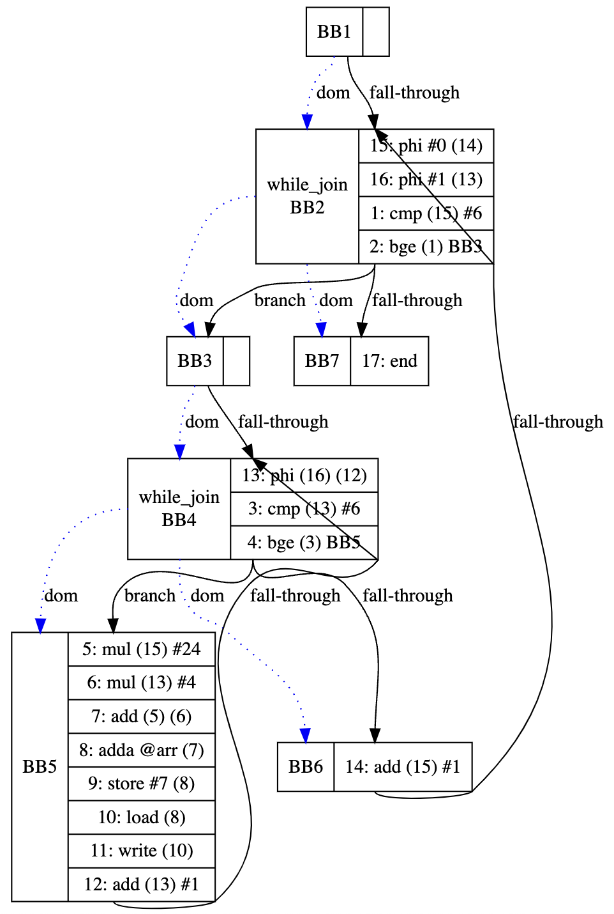
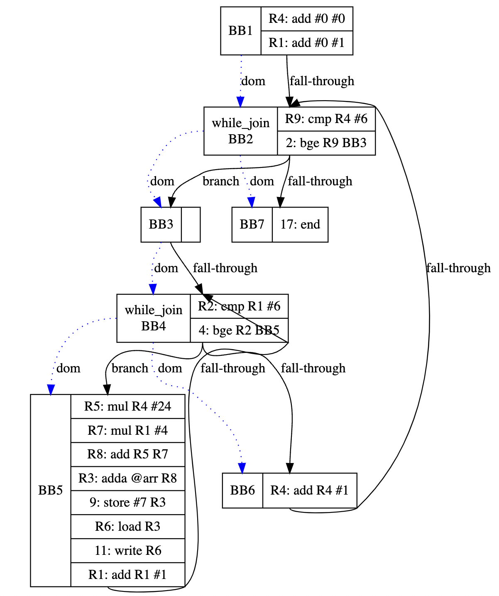

SMPL Compiler
=============

Smpl is a simple programming language used in the COMPSCI 241 Advanced Compiler Design class by Prof. Michael Franz at UC Irvine.

This is a compiler for SMPL with several optimization techniques and visualization using [DOT language](https://graphviz.org/doc/info/lang.html).

# Components

## Frontend

- Parser directly generate IR in SSA form
- Optimizations:
  - Global Value Numbering
  - Common Subexpression Elimination
  - Constant Folding
  - Dead Code Elimination

## Backend

- Register Allocator (use 32 Registers and spill to the memory)
- Optimizations:
  - Graph Coloring
  - Dead Code Elimination

# Example

## Usage

```
usage: main.py [-h] [--ssa] [--reg] smpl source file
```

## Sample SMPL Code

```
main
var row, col;
array[6][6] arr;
{
    let row <- 0;
    let col <- 1;
    while row < 6 do
        while col < 6 do
            let arr[row][col] <- 7;
            call OutputNum(arr[row][col]);
            let col <- col + 1
        od;
        let row <- row + 1
    od
}.
```

## Intermediate Representation (SSA Form)


## Register Allocation

